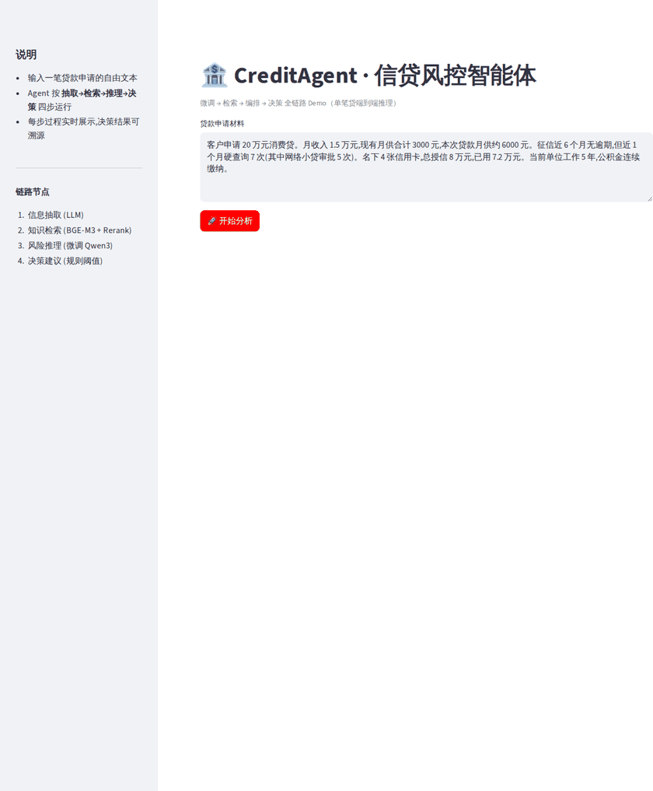
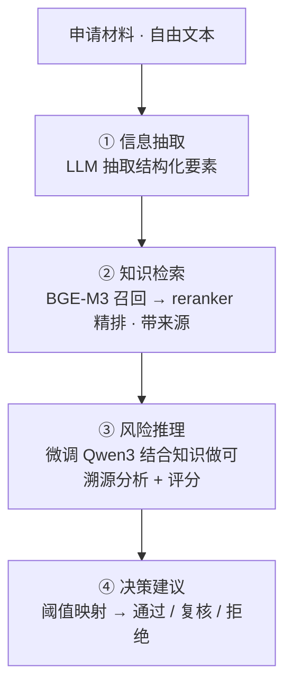

<div align="center">

# 🏦 CreditAgent · 信贷风控智能体

**端到端打通「微调 → 检索 → 编排 → 决策」的信贷风控 Agent**

[](https://www.python.org/)
[](https://github.com/QwenLM/Qwen3)
[](https://github.com/langchain-ai/langgraph)
[](https://github.com/vllm-project/vllm)
[](LICENSE)

</div>

---

CreditAgent 把**模型微调、知识检索、多步编排、规则决策**串成一条可复现、可溯源的信贷风控分析链路:输入一笔贷款申请的自由文本,自动抽取要素、检索风控知识、生成带依据的风险分析,并给出「通过 / 转人工复核 / 拒绝」的决策建议。

<div align="center">



</div>

## ✨ 核心特性

| 能力 | 实现 |
|------|------|
| 🎯 **微调** | LLaMA-Factory 对 Qwen3-4B 做 LoRA,适配信贷问答与征信报告解读 |
| 📚 **检索** | RAG 链路(BGE-M3 + FAISS + BGE-reranker),风控/征信知识**可溯源**问答 |
| 🔗 **编排** | LangGraph 多步 Agent(信息抽取 → 检索 → 推理 → 决策),自动化分析链路 |
| ⚖️ **决策** | 风险评分 + 阈值映射,输出通过 / 转人工复核 / 拒绝,理由可解释 |
| 🖥️ **交付** | Streamlit 交互 Demo + 命令行验证 + 批量评测(决策一致率) |

## 🧭 链路总览



## 🚀 快速开始

### 1. 环境准备

```bash
git clone <your-repo-url> CreditAgent && cd CreditAgent
python -m venv .venv && source .venv/bin/activate    # Windows: .venv\Scripts\activate
pip install -r requirements.txt

# 从模板生成本机配置,再按需修改(base_url / CUDA_HOME 等)
cp config/config.example.yaml config/config.yaml
cp scripts/start_vllm.example.sh scripts/start_vllm.sh
```

> 💡 **没有 GPU / 想先跑通?** 把 `config/config.yaml` 的 `llm` 指向任意 OpenAI 兼容服务
> (如本地 Ollama:`base_url: http://localhost:11434/v1`,`model_name: qwen2.5`),
> 跳过微调,直接从「构建 RAG 索引」开始。

### 2. 构建 RAG 索引

```bash
python -m rag.build_index 2>&1 | tee logs/build_index.log
```

首次运行会下载 BGE-M3 模型,完成后在 `rag/index/` 生成 `faiss.index`、`records.pkl`。
往 `data/knowledge/` 加 `.md` / `.txt` 文档后重跑此命令即可更新知识库。

### 3. 命令行验证整条链路

```bash
python -m scripts.run_cli
# 或传入自定义申请材料
python -m scripts.run_cli "客户申请30万元,月收入8000,已有月供5000..."
```

依次打印:**结构化要素 → 检索片段(带来源)→ 风险分析 → 决策建议**。

### 4. 启动交互 Demo

```bash
streamlit run app/streamlit_app.py
```

浏览器输入或使用内置样例,点击「开始分析」即可看到四步实时执行与最终决策。

## 🔧 微调与部署 Qwen3-4B

> 详见 [`finetune/README.md`](finetune/README.md)。已有可用的 OpenAI 兼容服务时本节可跳过。

```bash
# 1) 一键把微调样本自动扩充到 1k+(覆盖写入 data/finetune/credit_qa.json)
python -m scripts.gen_finetune_data -n 1200 --seed 42

# 2) 安装 LLaMA-Factory
git clone --depth 1 https://github.com/hiyouga/LLaMA-Factory.git
cd LLaMA-Factory && pip install -e ".[torch,metrics]" && cd ..

# 3) 训练(LoRA 适配器 → finetune/output/credit_lora/)
llamafactory-cli train finetune/train_lora.yaml

# 4) 合并 LoRA 到完整权重(→ finetune/output/credit_qwen3_merged/)
llamafactory-cli export \
  --model_name_or_path Qwen/Qwen3-4B \
  --adapter_name_or_path ./finetune/output/credit_lora \
  --template qwen --finetuning_type lora \
  --export_dir ./finetune/output/credit_qwen3_merged

# 5) 用 vLLM 部署成 OpenAI 兼容服务(先改好 start_vllm.sh 里的 CUDA_HOME)
nohup bash scripts/start_vllm.sh > logs/vllm_server.log 2>&1 &
```

> ⚠️ **较新 GPU(如 Blackwell sm_120)注意**:vLLM 默认用 FlashInfer,启动时会 **JIT 编译 CUDA 算子**,
> 需机器上有完整 CUDA 工具链(含 `nvcc`)并在 `start_vllm.sh` 把 `CUDA_HOME` 指向它。
> 也可不合并、直接挂 LoRA:`--enable-lora --lora-modules credit-lora=./finetune/output/credit_lora`。

## 📊 测试样本生成 + 批量评测

内置**测试样本生成器**:按「优质 / 中等 / 高风险」三类画像随机组合信贷要素,生成自然语言申请材料,
并用透明规则计算「参考决策」作为标准答案,再批量跑 Agent 链路对比一致率。

```bash
# 1) 生成 30 条可复现测试样本(覆盖 通过/复核/拒绝 三类)
python -m scripts.gen_test_samples -n 30 --seed 42

# 2) 批量跑链路并与参考决策对比,输出决策一致率
python -m scripts.eval_batch 2>&1 | tee logs/eval_batch.log

# (无 LLM 服务时)快速自检评测流程本身
python -m scripts.eval_batch --mock
```

输出示例:

```text
ID        画像    参考决策    Agent决策   参考分  Agent分  一致
----------------------------------------------------------------
case_001  medium  通过        通过        83     81      ✓
case_004  high    拒绝        拒绝        0      8       ✓
...
决策一致率: 27/30 = 90.0%
分画像一致率:  low 10/10 | medium 8/10 | high 9/10
```

## 🗂️ 项目结构

```text
CreditAgent/
├── config/
│   ├── config.example.yaml   # 配置模板(复制为 config.yaml 后按本机修改)
│   └── loader.py             # 配置加载工具
├── data/
│   ├── finetune/             # 微调数据(alpaca 格式)+ dataset_info.json
│   ├── knowledge/            # RAG 知识库原始文档
│   └── test/                 # 自动生成的测试样本与评测结果
├── finetune/
│   ├── train_lora.yaml       # LLaMA-Factory LoRA 训练配置
│   └── README.md             # 微调 + 部署步骤
├── rag/
│   ├── build_index.py        # 建索引:切分 → BGE-M3 编码 → FAISS
│   └── retriever.py          # 检索器:dense 召回 + rerank 精排
├── agent/
│   ├── state.py              # LangGraph 状态定义
│   ├── nodes.py              # 4 个节点:抽取 / 检索 / 推理 / 决策
│   ├── graph.py              # LangGraph 图装配
│   └── llm.py                # LLM 封装(OpenAI 接口 / 本地 transformers)
├── app/
│   └── streamlit_app.py      # 交互 Demo
├── scripts/
│   ├── start_vllm.example.sh # vLLM 部署脚本模板(复制为 start_vllm.sh 后改 CUDA_HOME)
│   ├── run_cli.py            # 单条命令行验证
│   ├── gen_finetune_data.py  # 自动扩充微调样本至 1k+(四类任务)
│   ├── gen_test_samples.py   # 自动生成测试样本(带标准答案)
│   └── eval_batch.py         # 批量评测:跑链路并与标准答案对比
├── CreditAgent_demo.png      # 交互 Demo 截图
├── LICENSE
└── requirements.txt
```

> **不入库的内容**:`config/config.yaml`、`scripts/start_vllm.sh`(含本机信息,仅提供 `*.example` 模板)、
> `.venv/`、`finetune/output/`(模型权重)、`rag/index/`、`logs/`、克隆来的 `LLaMA-Factory/`——
> 均已在 `.gitignore` 忽略,按上文步骤自行生成。

## ⚙️ 配置说明（`config/config.yaml`）

| 配置项 | 说明 |
|--------|------|
| `llm.backend` | `openai_api`(推荐)或 `transformers`(本地直接加载 base+LoRA) |
| `llm.base_url` / `model_name` | OpenAI 兼容服务地址与模型名 |
| `rag.top_k` / `rerank_top_n` | 粗排召回数 / 精排保留数 |
| `rag.chunk_size` / `chunk_overlap` | 知识切分粒度 |
| `agent.approve_threshold` / `review_threshold` | 决策阈值 |

## 🩺 常见问题

<details>
<summary><b>索引未找到 / 连接 LLM 失败 / 显存不足</b></summary>

- **索引未找到**:先执行 `python -m rag.build_index`。
- **连接 LLM 失败**:确认 vLLM/Ollama 已启动,且 `config.yaml` 的 `base_url`/`model_name` 与之匹配。
- **显存不足**:微调时在 `train_lora.yaml` 加 `quantization_bit: 4`(QLoRA);推理可换更小模型。

</details>

<details>
<summary><b>WSL2 下 <code>localhost:8000</code> / <code>:8501</code> 连接超时</b></summary>

镜像网络模式下,绑 `0.0.0.0` 的服务可能无法经 `127.0.0.1`/`localhost` 访问。改用 `hostname -I`
得到的 eth0 真实 IP(该 IP 重启可能变动,变动后同步更新 `config.yaml` 的 `base_url`)。

</details>

<details>
<summary><b>请求被代理拦截返回 502</b></summary>

若设了 `http(s)_proxy`,把 LLM 服务地址加入 `no_proxy`,或调用时加 `--noproxy '*'`(curl)。

</details>

<details>
<summary><b>vLLM 启动报 <code>Could not find nvcc</code> 或 <code>cannot find -lcudart</code></b></summary>

FlashInfer JIT 需要完整 CUDA 工具链。设 `CUDA_HOME` 指向含 `nvcc` 的目录;若库在 `lib/` 而非 `lib64/`,
用 `LIBRARY_PATH`/`LD_LIBRARY_PATH` 补全(`scripts/start_vllm.example.sh` 已含此处理)。

</details>

<details>
<summary><b>reranker 报 <code>XLMRobertaTokenizer has no attribute prepare_for_model</code></b></summary>

transformers 5.x 移除了该旧 API,而 FlagEmbedding 的 `FlagReranker` 仍依赖它。本项目的
`rag/retriever.py` 已改用 transformers 原生 cross-encoder 加载同一 reranker 权重,
并在其不可用时自动回退到 dense 召回排序,无需降级 transformers。

</details>

## 🛣️ 可扩展方向

- **数据**:`data/finetune/credit_qa.json` 扩到 1k+ 真实样本,提升解读质量。
- **风控模型**:`agent/nodes.py` 的 `decide_node` 当前为规则阈值,可替换为评分卡 / XGBoost 模型。
- **多路召回**:`retriever.py` 已用 BGE-M3 dense 向量,可加入 sparse 向量做混合检索。
- **可观测**:接入 LangSmith 追踪每个节点的输入输出。

## 📄 License

本项目基于 [MIT License](LICENSE) 开源。
