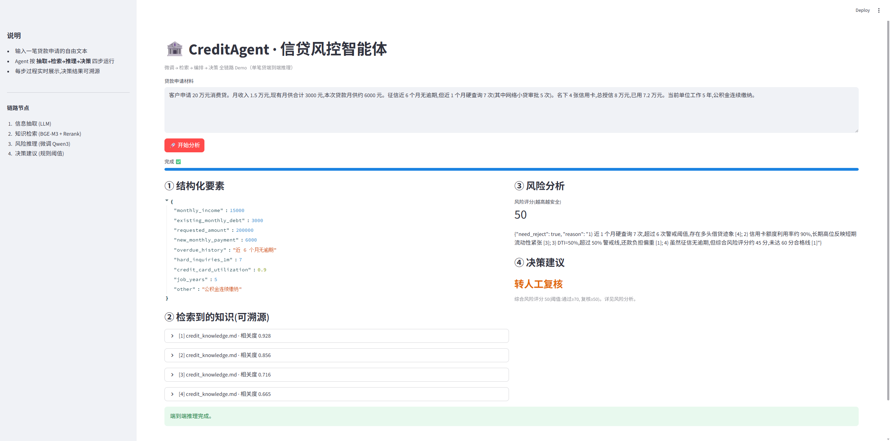

# CreditAgent · 信贷风控智能体

端到端打通 **「微调 → 检索 → 编排 → 决策」** 链路的信贷风控 Agent。

- **微调**:LLaMA-Factory 对 Qwen3-4B 做 LoRA,适配信贷问答与征信报告解读
- **检索**:RAG 链路(BGE-M3 + 向量库 FAISS + Rerank),实现风控/征信知识的可溯源问答
- **编排**:LangGraph 多步 Agent(信息抽取 → 检索 → 推理 → 决策建议),构建自动化分析链路
- **交付**:Streamlit 交互 Demo,支持单笔贷端到端推理验证



---

## 一、项目结构

```
CreditAgent/
├── config/
│   ├── config.example.yaml  # 配置模板(复制为 config.yaml 后按本机修改)
│   └── loader.py            # 配置加载工具
├── data/
│   ├── finetune/            # 微调数据(alpaca 格式)+ dataset_info.json
│   ├── knowledge/           # RAG 知识库原始文档
│   └── test/                # 自动生成的测试样本与评测结果
├── finetune/
│   ├── train_lora.yaml      # LLaMA-Factory LoRA 训练配置
│   └── README.md            # 微调 + 部署步骤
├── rag/
│   ├── build_index.py       # 建索引:切分 → BGE-M3 编码 → FAISS
│   └── retriever.py         # 检索器:dense 召回 + rerank 精排
├── agent/
│   ├── state.py             # LangGraph 状态定义
│   ├── nodes.py             # 4 个节点:抽取/检索/推理/决策
│   ├── graph.py             # LangGraph 图装配
│   └── llm.py               # LLM 封装(OpenAI 接口 / 本地 transformers)
├── app/
│   └── streamlit_app.py     # 交互 Demo
├── scripts/
│   ├── start_vllm.example.sh # vLLM 部署脚本模板(复制为 start_vllm.sh 后改 CUDA_HOME)
│   ├── run_cli.py           # 单条命令行验证
│   ├── gen_finetune_data.py # 自动扩充微调样本至 1k+(四类任务)
│   ├── gen_test_samples.py  # 自动生成测试样本(带标准答案)
│   └── eval_batch.py        # 批量评测:跑链路并与标准答案对比
├── CreditAgent_demo.png     # 交互 Demo 截图
├── LICENSE
└── requirements.txt
```

> 说明:`config/config.yaml`、`scripts/start_vllm.sh` 含本机信息,已被 `.gitignore` 忽略,
> 仓库只提供对应的 `*.example` 模板;`.venv/`、`finetune/output/`(模型权重)、
> `rag/index/`、`logs/`、克隆来的 `LLaMA-Factory/` 同样不入库,需按下文步骤自行生成。

## 二、链路示意

```
申请材料(自由文本)
      │
      ▼
[① 信息抽取]  LLM 抽取结构化要素(收入/负债/逾期/查询次数…)
      │
      ▼
[② 知识检索]  BGE-M3 召回 top_k → BGE-reranker 精排 top_n(带来源)
      │
      ▼
[③ 风险推理]  微调后的 Qwen3 结合知识做可溯源分析 + 风险评分
      │
      ▼
[④ 决策建议]  阈值映射 → 通过 / 转人工复核 / 拒绝
```

---

## 三、详细执行步骤

### 步骤 0:环境准备

```bash
cd CreditAgent
python -m venv .venv && source .venv/bin/activate    # Windows: .venv\Scripts\activate
pip install -r requirements.txt

# 从模板生成本机配置,再按需修改(base_url / CUDA_HOME 等)
cp config/config.example.yaml config/config.yaml
cp scripts/start_vllm.example.sh scripts/start_vllm.sh
```

### 步骤 1:微调 Qwen3-4B(可后置)

详见 `finetune/README.md`,核心三步:

```bash
# 0) 一键把微调样本自动扩充到 1k+(覆盖写入 data/finetune/credit_qa.json)
python -m scripts.gen_finetune_data -n 1200 --seed 42

# 1) 安装 LLaMA-Factory
git clone --depth 1 https://github.com/hiyouga/LLaMA-Factory.git
cd LLaMA-Factory && pip install -e ".[torch,metrics]" && cd ..

# 2) 训练(产物 LoRA 适配器在 finetune/output/credit_lora/)
llamafactory-cli train finetune/train_lora.yaml

# 3) 合并 LoRA 到完整权重(产物在 finetune/output/credit_qwen3_merged/)
llamafactory-cli export \
  --model_name_or_path Qwen/Qwen3-4B \
  --adapter_name_or_path ./finetune/output/credit_lora \
  --template qwen --finetuning_type lora \
  --export_dir ./finetune/output/credit_qwen3_merged

# 4) 用 vLLM 部署成 OpenAI 兼容服务(改好 scripts/start_vllm.sh 里的 CUDA_HOME 后)
nohup bash scripts/start_vllm.sh > logs/vllm_server.log 2>&1 &
```

> **部署注意(较新 GPU,如 Blackwell sm_120)**:vLLM 默认用 FlashInfer,启动时会
> **JIT 编译 CUDA 算子**,因此机器上需有完整的 CUDA 工具链(含 `nvcc`),并在
> `start_vllm.sh` 里把 `CUDA_HOME` 指向它。若工具链把库放在 `lib/` 而非 `lib64/`
> (常见于 conda 安装),脚本已用 `LIBRARY_PATH`/`LD_LIBRARY_PATH` 兜底。
>
> 也可不合并、直接挂 LoRA 部署:`--enable-lora --lora-modules credit-lora=./finetune/output/credit_lora`。

> **没有 GPU?** 先跳过微调,把 `config/config.yaml` 的 `llm` 指向任意可用的 OpenAI
> 兼容服务(如本地 Ollama:`base_url: http://localhost:11434/v1`,`model_name: qwen2.5`),
> 把整条链路先跑通,后续再替换为微调模型。

### 步骤 2:构建 RAG 索引

```bash
python -m rag.build_index 2>&1 | tee "logs/build_index.log"
```

首次运行会下载 BGE-M3 模型,完成后在 `rag/index/` 生成 `faiss.index`、`records.pkl`。
往 `data/knowledge/` 里加 `.md` / `.txt` 文档后,重新跑此命令即可更新知识库。

### 步骤 3:命令行验证整条链路

```bash
python -m scripts.run_cli
# 或传入自定义申请材料
python -m scripts.run_cli "客户申请30万元,月收入8000,已有月供5000..."

# 如本机设了 http(s)_proxy,需把 LLM 服务地址(config.yaml 里 base_url 的主机)
# 加入 no_proxy,避免请求被代理拦截:
NO_PROXY="127.0.0.1,localhost,<你的服务IP>" \
   .venv/bin/python -m scripts.run_cli 2>&1 | tee "logs/run_cli_$(date +%Y%m%d_%H%M%S).log"
```

会依次打印:结构化要素 → 检索片段(带来源)→ 风险分析 → 决策建议。

### 步骤 4:启动交互 Demo

```bash
streamlit run app/streamlit_app.py
```

浏览器打开后,输入或使用内置样例,点击「开始分析」即可看到四步实时执行与最终决策。

> **WSL 用户**:Streamlit 默认开在 `8501`。若 `localhost:8501` 打不开,改用
> `hostname -I` 得到的 eth0 IP 访问(原因见「常见问题」的 WSL 网络说明)。

### 步骤 5:自动生成测试样本 + 批量评测

为方便复现与展示,项目内置了**测试样本生成器**:按「优质 / 中等 / 高风险」三类画像
随机组合信贷要素,生成自然语言申请材料,并用一套透明规则计算「参考决策」作为标准答案。

```bash
# 1) 自动生成 30 条测试样本(可复现,改 --seed/-n 调整)
python -m scripts.gen_test_samples -n 30 --seed 42
#    -> data/test/test_samples.json,含 通过 / 转人工复核 / 拒绝 三类场景

# 2) 批量跑完整 Agent 链路,与参考决策对比,输出决策一致率
python -m scripts.eval_batch 2>&1 | tee "logs/eval_batch_$(date +%Y%m%d_%H%M%S).log
#    -> 控制台明细表 + 分画像一致率,结果存 data/test/eval_results.json

# (无 LLM 服务时)快速自检评测流程本身:
python -m scripts.eval_batch --mock
```

`eval_batch` 输出形如:

```
ID        画像    参考决策    Agent决策   参考分  Agent分  一致
----------------------------------------------------------------
case_001  medium  通过        通过        83     81      ✓
case_004  high    拒绝        拒绝        0      8       ✓
...
决策一致率: 27/30 = 90.0%
分画像一致率:  low 10/10 | medium 8/10 | high 9/10
```

> 这条评测链路就是面试时最直观的「它真的能跑、而且跑得对」的证据:
> 一条命令生成样本,一条命令看到 Agent 在几十个场景下的决策与标准答案的一致率。

---

## 四、配置说明(`config/config.yaml`)

| 配置项 | 说明 |
|---|---|
| `llm.backend` | `openai_api`(推荐)或 `transformers`(本地直接加载 base+LoRA) |
| `llm.base_url` / `model_name` | OpenAI 兼容服务地址与模型名 |
| `rag.top_k` / `rerank_top_n` | 粗排召回数 / 精排保留数 |
| `rag.chunk_size` / `chunk_overlap` | 知识切分粒度 |
| `agent.approve_threshold` / `review_threshold` | 决策阈值 |

## 五、可扩展方向

- **数据**:`data/finetune/credit_qa.json` 扩到 1k+ 真实样本,显著提升解读质量。
- **风控模型**:`agent/nodes.py` 的 `decide_node` 当前为规则阈值,可替换为评分卡 / XGBoost 风控模型。
- **多路召回**:`retriever.py` 已用 BGE-M3 dense 向量,可加入 BGE-M3 的 sparse 向量做混合检索。
- **可观测**:接入 LangSmith 追踪每个节点的输入输出。

## 六、常见问题

- **索引未找到**:先执行 `python -m rag.build_index`。
- **连接 LLM 失败**:确认 vLLM/Ollama 服务已启动,且 `config.yaml` 的 `base_url`/`model_name` 与之匹配。
- **显存不足**:微调时在 `train_lora.yaml` 加 `quantization_bit: 4`(QLoRA);推理可换更小模型。
- **WSL2 下 `localhost:8000`/`:8501` 连接超时**:镜像网络模式下,绑 `0.0.0.0` 的服务
  可能无法经 `127.0.0.1`/`localhost` 访问。改用 `hostname -I` 得到的 eth0 真实 IP
  (该 IP 重启可能变动,变动后同步更新 `config.yaml` 的 `base_url`)。
- **请求被代理拦截返回 502**:若设了 `http(s)_proxy`,把 LLM 服务地址加入 `no_proxy`,
  或调用时加 `--noproxy '*'`(curl)。
- **vLLM 启动报 `Could not find nvcc` 或 `cannot find -lcudart`**:FlashInfer JIT 需要
  完整 CUDA 工具链。设 `CUDA_HOME` 指向含 `nvcc` 的目录;若库在 `lib/` 而非 `lib64/`,
  用 `LIBRARY_PATH`/`LD_LIBRARY_PATH` 补全(`scripts/start_vllm.example.sh` 已含此处理)。
- **reranker 报 `XLMRobertaTokenizer has no attribute prepare_for_model`**:transformers 5.x
  移除了该旧 API,而 FlagEmbedding 的 `FlagReranker` 仍依赖它。本项目的 `rag/retriever.py`
  已改用 transformers 原生 cross-encoder 加载同一 reranker 权重,并在其不可用时自动回退到
  dense 召回排序,无需降级 transformers。
